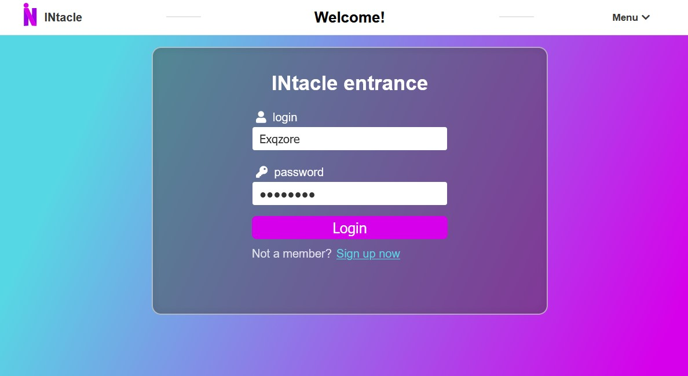

# WorkLance
INtacle - social network.

## Table of contents
1. [General info](#General-info)
2. [Features](#Features)
3. [Showcase](#Showcase)
4. [Database structure](#Database-structure)
5. [Technologies](#Technologies)
___
## General info
INtacle - social network.

#### Roles
- Guest
    - Can sign in
    - Can sign up
    - Can change language
- User
    - Can do all the stuff, that guest can
    - Can edit his profile and avatar image
    - Can publish posts and edit them
    - Can delete his posts
    - Can create comments for all posts
    - Can delete comments on his posts
    - Can subscribe and unsubscribe to other users
    - Can like all comments and posts
    - Can log out
    - Can see posts of other users
    - Can see profiles of other users
    - Can create private chats with other users
    - Can use search form to find users
- Editor
    - Can do all the stuff, that user can
    - Can delete all comments
    - Can delete all posts
    - Can edit all posts
- Admin
    - Can do all the stuff, that editor can
    - Can change user and editor roles
    - Can watch admin panel

___
## Features
### Full service localization
All text content that is on pages can be translated by one click
from **English** to **Russian** and vice versa.

### Activation system
To use the account, the user must activate it by clicking on the link sent to the email address

### Presence of links
Presence of links ease the way users can view profiles
and pages of other users

### Async messenger
Users can send messages to each other asynchronously without updating page

### Async like/unlike system
Users can like/unlike comments and posts without updating page

___
## Showcase

___
## Database structure

___
## Technologies
- [JDK 8](https://www.oracle.com/java/technologies/javase/javase-jdk8-downloads.html) - Java Development kit 8
- [Maven](https://maven.apache.org/) - Project build tool
- [Tomcat](http://tomcat.apache.org/) - Servlet container
- [Java EE](https://www.oracle.com/java/technologies/java-ee-glance.html) - Java Servlet, JSP(Java server pages)
- [MySQL](https://www.mysql.com/) - Open source SQL database
- [JDBC](https://docs.oracle.com/javase/8/docs/technotes/guides/jdbc/) - Java Database Connectivity API
- [JSTL](https://docs.oracle.com/javaee/5/tutorial/doc/bnake.html) - Library for JSP
- [Log4j](https://logging.apache.org/log4j/2.x/) - Logging library
- [TestNG](https://testng.org/doc/) - Testing framework
